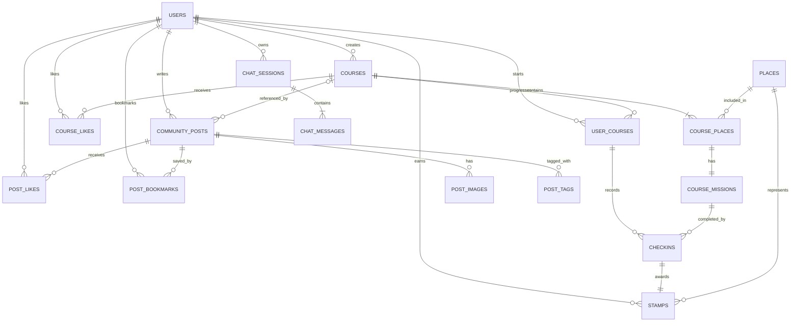

# DB 관계도 및 테이블 명세

현재 `backend/app/database.py`와 실행 중인 SQLite 스키마를 기준으로 작성한 문서입니다.

- DBMS: SQLite
- DB 파일: `backend/app.db`
- 스키마 버전: `normalized-v1`
- 초기화 진입점: `init_db()`
- 외래키 적용: 연결마다 `PRAGMA foreign_keys = ON`

서버 최초 실행 시 DB와 정규화 테이블을 생성하고 `data` 디렉터리의 서울 관광 JSON을 `places`에 적재합니다. 기존 DB에는 누락 컬럼을 `ALTER TABLE`로 추가하고 레거시 데이터를 정규화 테이블로 이전합니다.

## 설계 개요

- 관광 원본 장소와 서비스 코스를 분리합니다.
- 코스의 방문 장소, 미션, 사용자별 진행, 체크인, 스탬프를 각각 분리합니다.
- 한 코스를 여러 사용자가 독립적으로 진행할 수 있습니다.
- 커뮤니티 작성자는 내부 사용자 ID로 권한을 판별하지만 화면에는 `익명 사용자`로 표시합니다.
- 좋아요, 북마크, 태그, 이미지는 별도 테이블로 관리합니다.
- 비밀번호 원문은 저장하지 않고 PBKDF2-SHA256 해시 문자열만 저장합니다.

## 전체 관계도

## 표기

- PK: 기본키
- FK: 외래키
- UK: 유일키
- NN: `NOT NULL`
- 기본 시각 값은 SQLite `CURRENT_TIMESTAMP`를 사용합니다.

## 사용자

### `users`

사용자 로그인 정보와 클라이언트 소유권 키를 관리합니다.

| 컬럼 | 타입 | 제약·기본값 | 설명 |
| --- | --- | --- | --- |
| `id` | INTEGER | PK, AUTOINCREMENT | 내부 사용자 ID |
| `nickname` | TEXT | UK, NN | 로그인 식별용 닉네임 |
| `profile_icon` | TEXT | NN | 프로필 아이콘 코드, 현재 기본값 `mask` |
| `created_at` | TEXT | `CURRENT_TIMESTAMP` | 사용자 생성 시각 |
| `anonymous_key` | TEXT | 유일 인덱스, NULL 허용 | `user:{id}` 또는 레거시 소유권 키 |
| `password_hash` | TEXT | NULL 허용 | `pbkdf2_sha256$반복횟수$salt$digest` 형식 |

`anonymous_key`에는 `idx_users_anonymous_key` 유일 인덱스가 적용됩니다. 기존 사용자의 빈 키는 마이그레이션 시 `user:{id}`로 채웁니다. `password_hash`가 없는 레거시 사용자는 다음 로그인에서 입력한 비밀번호로 해시를 최초 등록합니다.

## 관광 데이터

### `places`

한국관광공사 TourAPI 원본 데이터를 저장합니다.

| 컬럼군 | 타입 | 제약·기본값 | 설명 |
| --- | --- | --- | --- |
| `id` | INTEGER | PK, AUTOINCREMENT | 장소 ID |
| `source_file` | TEXT | NN | 적재한 원본 JSON 파일명 |
| `region`, `addr1`, `addr2`, `zipcode` | TEXT |  | 지역, 주소, 자치구, 우편번호 |
| `content_type`, `content_type_id` | TEXT |  | 서비스 분류와 분류 ID |
| `contentid` | TEXT | UK | TourAPI 콘텐츠 ID |
| `contenttypeid`, `areacode`, `sigungucode` | TEXT |  | 원본 관광·행정 코드 |
| `title`, `tel` | TEXT |  | 장소명과 연락처 |
| `mapx`, `mapy` | TEXT |  | 원본 경도·위도 문자열 |
| `longitude`, `latitude` | REAL | 마이그레이션 추가 | 거리 계산용 숫자 좌표 |
| `mlevel` | TEXT |  | 지도 축척 레벨 |
| `lDongRegnCd`, `lDongSignguCd` | TEXT |  | 법정동 코드 |
| `cat1`, `cat2`, `cat3` | TEXT |  | 구 관광 분류 코드 |
| `lclsSystm1`, `lclsSystm2`, `lclsSystm3` | TEXT |  | 신 관광 분류 코드 |
| `firstimage`, `firstimage2` | TEXT |  | 이미지 URL |
| `cpyrhtDivCd` | TEXT |  | 이미지 저작권 구분 |
| `createdtime`, `modifiedtime` | TEXT |  | 원본 생성·수정 시각 |

`longitude`, `latitude`는 각각 `mapx`, `mapy`를 `REAL`로 변환해 채웁니다.

## 코스와 미션

### `courses`

AI 추천 결과, 사용자 코스, 시스템 코스를 공통 저장합니다.

| 컬럼 | 타입 | 제약·기본값 | 설명 |
| --- | --- | --- | --- |
| `id` | INTEGER | PK, AUTOINCREMENT | 코스 ID |
| `created_by` | INTEGER | FK→`users.id`, NULL 허용 | 코스 생성 사용자 |
| `title` | TEXT | NN | 코스명 |
| `description` | TEXT |  | 코스 설명 |
| `district` | TEXT | NN | 대표 서울 자치구 |
| `theme` | TEXT | NN | 역사, 야경, 자연 등의 테마 |
| `source` | TEXT | NN, CHECK | `ai`, `user`, `system` 중 하나 |
| `image_url` | TEXT |  | 대표 이미지 |
| `total_distance_km` | REAL | NN, `0` | 코스 전체 거리 |
| `estimated_hours` | INTEGER | NN, `1` | 예상 소요 시간 |
| `created_at` | TEXT | NN, `CURRENT_TIMESTAMP` | 생성 시각 |

사용자가 삭제되면 `created_by`만 `NULL`로 바뀌며 코스 원본은 유지됩니다(`ON DELETE SET NULL`).

### `course_places`

| 컬럼 | 타입 | 제약·기본값 | 설명 |
| --- | --- | --- | --- |
| `id` | INTEGER | PK, AUTOINCREMENT | 코스 장소 ID |
| `course_id` | INTEGER | FK→`courses.id`, NN | 소속 코스 |
| `place_id` | INTEGER | FK→`places.id`, NN | 원본 장소 |
| `sequence_no` | INTEGER | NN, 코스 내 UK | 방문 순서 |
| `distance_from_previous_km` | REAL | NN, `0` | 직전 장소와의 거리 |

코스 삭제 시 함께 삭제되고, 참조 중인 장소 삭제는 제한됩니다.

### `course_missions`

코스 장소당 하나의 체크인 미션을 갖습니다.

| 컬럼 | 타입 | 제약·기본값 | 설명 |
| --- | --- | --- | --- |
| `id` | INTEGER | PK, AUTOINCREMENT | 미션 ID |
| `course_place_id` | INTEGER | FK→`course_places.id`, UK, NN | 대상 코스 장소 |
| `title` | TEXT | NN | 미션명 |
| `description` | TEXT |  | 안내 문구 |
| `mission_type` | TEXT | NN, `checkin` 고정 | 미션 유형 |
| `stamp_reward` | INTEGER | NN, `1` | 완료 보상 스탬프 수 |

## 사용자별 여행 로그

### `user_courses`

| 컬럼 | 타입 | 제약·기본값 | 설명 |
| --- | --- | --- | --- |
| `id` | INTEGER | PK, AUTOINCREMENT | 여행 로그 진행 ID |
| `user_id` | INTEGER | FK→`users.id`, NN | 진행 사용자 |
| `course_id` | INTEGER | FK→`courses.id`, NN | 진행 코스 |
| `status` | TEXT | NN, CHECK | `in_progress` 또는 `completed` |
| `current_sequence` | INTEGER | NN, `1` | 현재 활성 미션 순서 |
| `started_at` | TEXT | NN, `CURRENT_TIMESTAMP` | 시작 시각 |
| `completed_at` | TEXT | NULL 허용 | 전체 완료 시각 |

`(user_id, course_id)`가 유일하므로 같은 사용자가 동일 코스를 중복 시작하지 않습니다.

### `checkins`

| 컬럼 | 타입 | 제약·기본값 | 설명 |
| --- | --- | --- | --- |
| `id` | INTEGER | PK, AUTOINCREMENT | 체크인 ID |
| `user_course_id` | INTEGER | FK→`user_courses.id`, NN | 사용자 코스 진행 |
| `mission_id` | INTEGER | FK→`course_missions.id`, NN | 완료 미션 |
| `checked_in_at` | TEXT | NN, `CURRENT_TIMESTAMP` | 체크인 시각 |

`(user_course_id, mission_id)`가 유일해 한 진행에서 같은 미션을 중복 완료할 수 없습니다.

### `stamps`

| 컬럼 | 타입 | 제약·기본값 | 설명 |
| --- | --- | --- | --- |
| `id` | INTEGER | PK, AUTOINCREMENT | 스탬프 ID |
| `user_id` | INTEGER | FK→`users.id`, NN | 획득 사용자 |
| `checkin_id` | INTEGER | FK→`checkins.id`, UK, NN | 스탬프를 만든 체크인 |
| `place_id` | INTEGER | FK→`places.id`, NN | 방문 장소 |
| `earned_at` | TEXT | NN, `CURRENT_TIMESTAMP` | 획득 시각 |

체크인 한 건당 스탬프 한 건만 생성됩니다. 사용자 코스를 포기하거나 완료 내역을 삭제하면 체크인과 스탬프도 연쇄 삭제됩니다.

### `course_likes`

| 컬럼 | 타입 | 제약·기본값 | 설명 |
| --- | --- | --- | --- |
| `course_id` | INTEGER | 복합 PK, FK→`courses.id` | 좋아요 대상 코스 |
| `user_id` | INTEGER | 복합 PK, FK→`users.id` | 좋아요 사용자 |
| `created_at` | TEXT | NN, `CURRENT_TIMESTAMP` | 좋아요 시각 |

인기 코스는 코스별 `COUNT(user_id)`로 집계합니다.

## 익명 커뮤니티

### `community_posts`

| 컬럼 | 타입 | 제약·기본값 | 설명 |
| --- | --- | --- | --- |
| `id` | INTEGER | PK, AUTOINCREMENT | 게시글 ID |
| `author_id` | INTEGER | FK→`users.id`, NN | 작성자 및 수정·삭제 권한 판별 |
| `course_id` | INTEGER | FK→`courses.id`, NULL 허용 | 선택 연결 코스 |
| `title` | TEXT | NN | 제목 |
| `content` | TEXT | NN | 본문 |
| `region` | TEXT | NN, `서울특별시` | 광역 지역 |
| `district` | TEXT | NN | 자치구 |
| `like_count` | INTEGER | NN, `0` | 빠른 목록 조회용 좋아요 캐시 |
| `created_at` | TEXT | NN, `CURRENT_TIMESTAMP` | 작성 시각 |
| `view_count` | INTEGER | NN, `0`, 마이그레이션 추가 | 상세 조회 횟수 |

작성자 삭제 시 게시글도 삭제됩니다. 연결 코스 삭제 시 `course_id`만 `NULL`이 됩니다. 상세 조회 시 `view_count`가 1 증가합니다.

### `post_images`

| 컬럼 | 타입 | 제약·기본값 | 설명 |
| --- | --- | --- | --- |
| `id` | INTEGER | PK, AUTOINCREMENT | 이미지 ID |
| `post_id` | INTEGER | FK→`community_posts.id`, NN | 게시글 |
| `image_url` | TEXT | NN | 이미지 URL |
| `sort_order` | INTEGER | NN, `0` | 노출 순서 |

### `post_tags`

| 컬럼 | 타입 | 제약·기본값 | 설명 |
| --- | --- | --- | --- |
| `post_id` | INTEGER | 복합 PK, FK→`community_posts.id` | 게시글 |
| `tag` | TEXT | 복합 PK | 태그 문자열 |

API는 공백과 `#` 접두어를 정리하고 중복을 제거한 뒤 최대 5개 태그를 저장합니다.

### `post_likes`

| 컬럼 | 타입 | 제약·기본값 | 설명 |
| --- | --- | --- | --- |
| `post_id` | INTEGER | 복합 PK, FK→`community_posts.id` | 좋아요 게시글 |
| `user_id` | INTEGER | 복합 PK, FK→`users.id` | 좋아요 사용자 |
| `created_at` | TEXT | NN, `CURRENT_TIMESTAMP` | 좋아요 시각 |

좋아요 토글 시 이 테이블과 `community_posts.like_count` 캐시를 함께 갱신합니다.

### `post_bookmarks`

| 컬럼 | 타입 | 제약·기본값 | 설명 |
| --- | --- | --- | --- |
| `post_id` | INTEGER | 복합 PK, FK→`community_posts.id` | 북마크 게시글 |
| `user_id` | INTEGER | 복합 PK, FK→`users.id` | 북마크 사용자 |
| `created_at` | TEXT | NN, `CURRENT_TIMESTAMP` | 북마크 시각 |

북마크 수는 별도 캐시 컬럼 없이 이 테이블을 집계합니다.

### 커뮤니티 통계와 정렬

- 권역별 현황은 게시글 자치구를 서울 5개 권역으로 묶어 집계합니다.
- 인기 자치구 TOP 5는 좋아요, 조회수, 북마크 수 합산 기준입니다.
- 게시글 인기순도 `like_count + view_count + bookmark_count` 합산 기준입니다.
- `mine_only`는 `community_posts.author_id`와 현재 사용자 ID를 비교합니다.
- `bookmarked_only`는 `post_bookmarks` 존재 여부로 필터링합니다.

## 챗봇 테이블

### `chat_sessions`

| 컬럼 | 타입 | 제약·기본값 | 설명 |
| --- | --- | --- | --- |
| `id` | INTEGER | PK, AUTOINCREMENT | 대화 세션 ID |
| `user_id` | INTEGER | FK→`users.id`, NN | 사용자 |
| `created_at` | TEXT | NN, `CURRENT_TIMESTAMP` | 생성 시각 |

### `chat_messages`

| 컬럼 | 타입 | 제약·기본값 | 설명 |
| --- | --- | --- | --- |
| `id` | INTEGER | PK, AUTOINCREMENT | 메시지 ID |
| `session_id` | INTEGER | FK→`chat_sessions.id`, NN | 소속 세션 |
| `role` | TEXT | NN, CHECK | `user` 또는 `assistant` |
| `content` | TEXT | NN | 메시지 본문 |
| `created_at` | TEXT | NN, `CURRENT_TIMESTAMP` | 생성 시각 |

두 테이블은 스키마에 준비되어 있지만 현재 프론트엔드의 추천 대화는 메모리 상태로 관리하며 DB에 저장하지 않습니다.

## 스키마 이력

### `schema_migrations`

| 컬럼 | 타입 | 제약·기본값 | 설명 |
| --- | --- | --- | --- |
| `version` | TEXT | PK | 적용한 마이그레이션 버전 |
| `applied_at` | TEXT | NN, `CURRENT_TIMESTAMP` | 적용 시각 |

현재 정규화 마이그레이션 버전은 `normalized-v1`입니다. 레거시 커뮤니티·코스·미션·진행 데이터를 새 테이블로 옮긴 후 레거시 테이블을 제거합니다.

## 인덱스

| 인덱스 | 대상 | 용도 |
| --- | --- | --- |
| `idx_users_anonymous_key` | `users(anonymous_key)` | 소유권 키 유일성 및 사용자 조회 |
| `idx_places_district_type` | `places(addr2, content_type)` | 자치구·카테고리 추천 검색 |
| `idx_places_coordinates` | `places(latitude, longitude)` | 좌표 기반 장소 검색 |
| `idx_courses_district_theme` | `courses(district, theme)` | 자치구·테마 코스 검색 |
| `idx_user_courses_user_status` | `user_courses(user_id, status)` | 사용자별 진행·완료 목록 |
| `idx_posts_district_created` | `community_posts(district, created_at DESC)` | 지역별 최신 게시글 |
| `idx_checkins_user_course` | `checkins(user_course_id)` | 코스 진행별 체크인 조회 |

복합 PK와 UK에 필요한 SQLite 자동 인덱스도 생성됩니다.

## 삭제 규칙

| 삭제 대상 | 연쇄 동작 |
| --- | --- |
| 사용자 | 여행 로그, 스탬프, 좋아요, 게시글, 북마크, 챗 세션 삭제 |
| 코스 | 코스 장소·미션, 사용자 진행, 코스 좋아요 삭제; 연결 게시글의 `course_id`는 NULL |
| 코스 장소 | 연결 미션 삭제 |
| 사용자 코스 | 체크인과 해당 스탬프 삭제 |
| 체크인 | 해당 스탬프 삭제 |
| 커뮤니티 게시글 | 이미지, 태그, 좋아요, 북마크 삭제 |
| 챗 세션 | 메시지 삭제 |

`places`는 코스 장소와 스탬프에서 `ON DELETE RESTRICT`로 보호됩니다. `course_missions`도 체크인에서 `ON DELETE RESTRICT`로 보호됩니다.

## 주요 무결성 규칙

- `users.nickname`과 `users.anonymous_key`는 유일합니다.
- `course_places(course_id, sequence_no)`는 유일합니다.
- `course_missions.course_place_id`는 유일해 장소당 미션 하나만 허용합니다.
- `user_courses(user_id, course_id)`는 유일합니다.
- `checkins(user_course_id, mission_id)`는 유일합니다.
- `stamps.checkin_id`는 유일해 체크인당 스탬프 한 건만 허용합니다.
- 좋아요·북마크 테이블은 대상 ID와 사용자 ID의 복합 PK로 중복 반응을 방지합니다.
- `post_tags(post_id, tag)` 복합 PK로 같은 게시글의 중복 태그를 방지합니다.
- 코스 진행 순서는 `user_courses.current_sequence`와 미션 순서를 서버에서 비교해 강제합니다.
